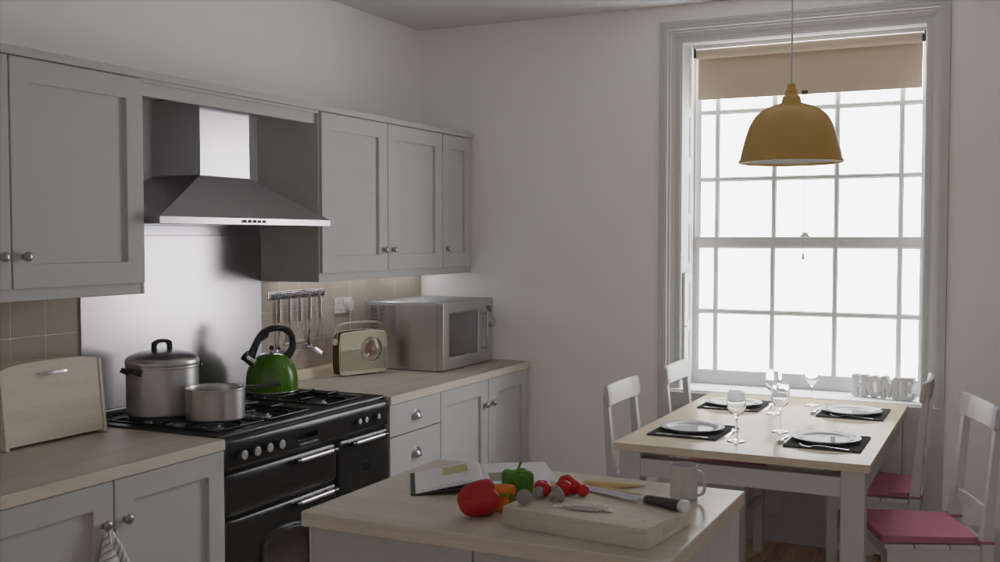
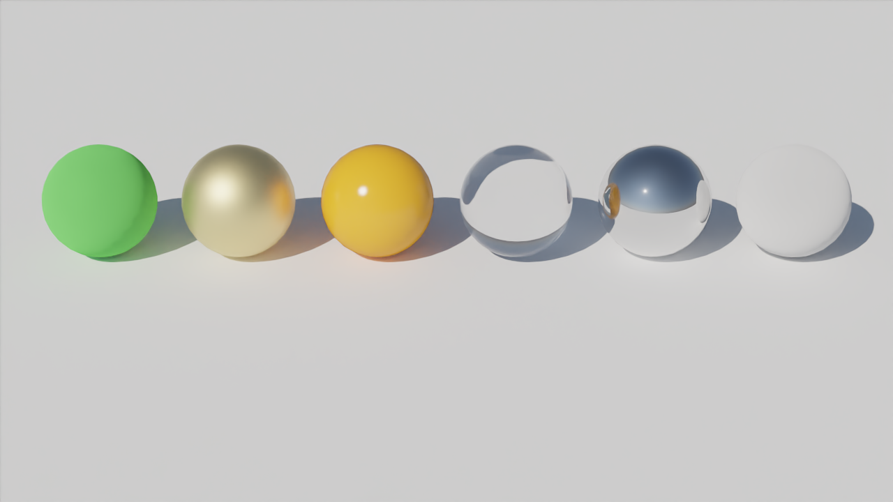
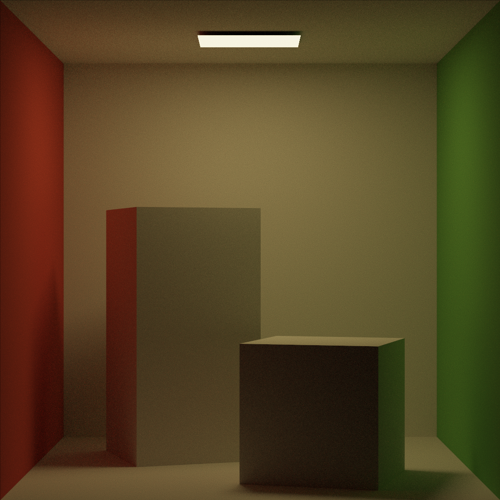

# Ray Tracing Renderer

A C++ renderer exploring material sampling, global illumination, acceleration structures, and image reconstruction. It supports path tracing, instant radiosity, and light tracing, with Intel Open Image Denoise integration.


*Kitchen scene, 128 samples per pixel, with OIDN denoising. This is an existing renderer output, not a newly measured render.*

## Features

Built on the Advanced Computer Graphics course framework, with the following rendering features:

- **Materials:** a common BSDF evaluation, sampling, and PDF interface, with diffuse, mirror, dielectric/glass, and GGX conductor materials.
- **Global illumination:** path tracing with next-event estimation, multiple importance sampling, and Russian roulette; alternative instant-radiosity and light-tracing modes for comparison.
- **Environment lighting:** importance sampling weighted by image luminance and spherical area, with directional PDF conversion.
- **Ray acceleration:** binned SAH BVH construction, closest-hit traversal, and early-out visibility queries.
- **CPU parallelism:** screen-tile rendering with atomic task distribution.
- **Reconstruction:** sample accumulation and normalization, albedo/normal auxiliary buffers, and OIDN denoising.

## Render gallery


*Material study at 128 SPP with denoising.*

| Path tracing, 128 SPP | Same output with OIDN |
| --- | --- |
|  |  |

The comparison shows the stored outputs at the same sample count. It does not imply that denoising is ground truth or that all fine details are preserved.

## Build

1. Use Windows, the MSVC v143 C++ toolset, and Windows SDK. Open `RTBase.sln` and select **Release | x64**. This configuration enables AVX2.
2. The project expects Intel OIDN under `RTBase/external/oidn/`, with `include/`, `lib/`, and `bin/` directories. Supply a matching Windows x64 OIDN distribution: the checked-in directory has headers/libraries but no `bin/` directory.
3. Ensure `OpenImageDenoise.lib` and its matching runtime DLLs are present. The post-build step copies `external/oidn/bin/*.dll` beside the executable; include the distribution's required runtime dependencies.
4. Build, and set the working directory to `RTBase/`, where `Assets/` and `results/` reside.

## Run

From `RTBase/`, using the solution's default x64 output location:

```powershell
..\x64\Release\RTBase.exe -scene Assets/kitchen -SPP 128 -mode pt
```

| Argument | Values / behavior |
| --- | --- |
| `-scene` | Scene directory, such as `Assets/MaterialsScene`, `Assets/cornell-box`, or `Assets/kitchen` |
| `-SPP` | Positive sample count; default `128` |
| `-mode` | `pt` (path tracing), `ir` (instant radiosity), `lt` (light tracing) |
| `-outputFilename` | Filename used by the manual `P`/`L` save controls; default `GI.hdr` |

At the target SPP, final outputs use `results/<scene>-<mode>-<SPP>` naming. The `-outputFilename` argument does not rename those automatic final outputs. `W/A/S/D` moves the camera, `Q/E` moves vertically, `P` saves HDR, `L` saves PNG, and Escape exits.

## Code guide

- [`Main.cpp`](RTBase/Main.cpp): CLI options, camera input, render loop, and output naming.
- [`Renderer.h`](RTBase/Renderer.h): integrators, parallel rendering, accumulation, and denoising.
- [`Materials.h`](RTBase/Materials.h): BSDF implementations.
- [`Geometry.h`](RTBase/Geometry.h): intersection and BVH logic.
- [`Lights.h`](RTBase/Lights.h): lighting and environment sampling.
- [`SceneLoader.h`](RTBase/SceneLoader.h): scene loading.

See the [project report](WM9M3.pdf) for experiments and comparisons. GamesEngineeringBase and course scaffolding provided the starting infrastructure; Intel OIDN provides the denoiser. Scene geometry and textures are input assets, not original modeling work.
